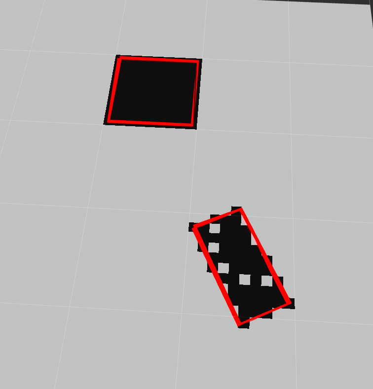

# 📦 DRCCLPVMPC ROS2 Package

This repo is the ros2 package of Distributionally Robust Chance Constraints Linear Parameter Varying MPC (DRCCLPVMPC). The numerical simulation results of [DRCCLPVMPC](https://github.com/Binghamton-ACSR-Lab/drcclpvmpc) shows the proposed local control is capable to maintain a rubust tracking and obstacle avoidance behaviors.

Required System: Ubuntu 24.04

Tested ROS2 Version: ROS2 kilted kaiju

Recommended Simulation Software: Carla 0.9.16

AI usage disclosure: AI is used for assisting code writing.

Subscribed topics:

- `nav_msgs/Odometry` on **`/odom`**: We recommend the user publish a single odometry topic where the state of the vehicle (Bicycle Model) is included (x, y, $\phi$, $v_x$,$v_y$,$\omega$).
- `std_msgs/Float32MultiArray` on **`/obs_box`**: This message contains the four corner coordinates of the boxes that contains the obstacles ([x11,y11,x12,y12, ...]), the topic should be published with the same rate of odometry, the polygons can be obtained by using similar method to **`costmap_converter`** in ROS1, we have included one node that achieve similar goal (tested only).

The controller will call the global server once set goal position in rviz2, the name of the server can be modified in **`drcclpvmpc_ros2/config/your_config.yaml`** behind **`service_name`**.

Published topics:

* `std_msgs/Float32MultiArray` on `\control_cmd`: this publish [steering (rad), pwm (0-1)] data when set `control_type` to `pwm`
* `std_msgs/Float32MultiArray` on  `\velocity_cmd`: this publish [steering (rad), vx (m/s)] data when set `control_type` to `vx`

---

## 🚀 Installation

To install the package and run the demo with CARLA:

```
mkdir -p ~/CARLA_0916
```

download the nightly build of carla 0.9.16 from [CARLA](https://carla.readthedocs.io/en/latest/download/) and extract the tar file in the created folder:

```
tar -xvf CARLA_Latest.tar.gz -C ~/CARLA_0916
cd ~
```

Now clone the ros2 workspace to home:

```
git clone https://github.com/Heliosfang/ros2_ws.git
cd ros2_ws
cp run_carla.sh ~/CARLA_0916
cp load_town05.py ~/CARLA_0916
cd ~/CARLA_0916
chmod +x run_carla.sh
chmod +x load_town05.py
```

Now carla should be ready to run and automatically load town05 by running:

```
./run_carla.sh
```

To build the ros2 package, make sure **`ros2 kilted kaiju`** is properly installed.

```bash
cd ~
git clone https://github.com/Heliosfang/ros2_ws.git
cd ros2_ws
rosdep install --from-paths src --ignore-src -r -y
colcon build
```

## Run simulation

We show the simulation with carla, make sure the carla is already opened by running following:

```BASH
cd ~/CARLA_0916
./run_carla.sh
```

open another terminal:

```bash
cd ~/ros2_ws
source install/setup.bash
ros2 launch carla_vehicle_spawner spawn_vehicle_static.launch.py
```

You should see the spawned vehicle and static traffic cones in carla now.

Open another terminal:

```bash
source install/setup.bash
ros2 launch drcclpvmpc_ros2 drcclpvmpc_planner.launch.py
```

In the simulation we just make the global path server give the path message by reading from file, so you can just give any **`2D Goal Pose`** in rviz2, this will trigger the controller to call the path server and start tracking.

Demo video can be found in:

▶️ [Watch Demo](https://drive.google.com/file/d/1AYFfqVLeKRJNjaqzqaHhxtrmDxbeSRML/view?usp=sharing)

## Build your own configuration

By default the package use lincoln mkz 2017 vehicle, with the tire model (B,C,D) and drivetrain model (Cm1, Cm2, Cr0, Cd)  obtained by using [FTHD](https://github.com/Binghamton-ACSR-Lab/FTHD.git), the user may create their own `yaml` and launch file, descriptions of the parameters can be find in `lincoln_planner.yaml`.

We did not specify the tracking weights and drcc weights in the configuration, if you see optimization failure or abnormal behavior of the control in your own experiments, we recommend the user go check `drcclpvmpc_ros2/mpc/drcclpvmpc_core.py` where the weights are specified in `line 226-263`.

To give the proper message of the obstacles, one approach can be using the `costmap_2d` message, here we only show a demo which convert the costmap message to our desired type of topic with name `/rectangles`:

```bash
source install/setup.bash
ros2 launch obstacle_spawn demo_rectangles.launch.py
```


